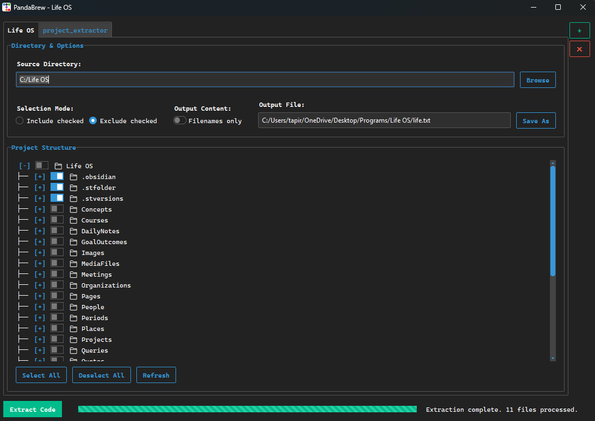

# <div align="center"></div>

# <h1 align="center">PandaBrew Code Extractor</h1>

<div align="center">

A modern, cross-platform GUI utility and CLI for selectively extracting and packaging project source code into a single, comprehensive text file. Perfect for creating project snapshots for LLMs, documentation, or code reviews.

[](https://github.com/KazeFreeze/PandaBrew/releases)
[](https://github.com/KazeFreeze/PandaBrew/actions/workflows/build-and-release.yml)
[](https://opensource.org/licenses/MIT)

</div>

---

PandaBrew is a desktop application and command-line tool built with Python that provides an intuitive way to browse a project directory, select files and folders, and consolidate their structure and content into a single output file. It's designed to be fast, user-friendly, and powerful.

## ✨ Key Features

- **Cross-Platform**: Natively supports **Windows** and **Fedora Linux**.
- **Modern Tabbed GUI**: Manage multiple project extractions in separate tabs.
- **Flexible File Selection**: Manually check files and folders to include or exclude them.
- **Advanced `.gitignore`-style Filtering**: Use global include/exclude patterns to finely control which files are processed.
- **Verbose Structure View**: Optionally display excluded files and folders in the project tree to easily debug your filter patterns.
- **Command-Line Interface**: A separate CLI for automation and scripting workflows.
- **Persistent Sessions**: The app remembers your open tabs, file selections, and window settings between sessions.
- **Responsive UI**: File processing is handled in a separate thread, so the UI never freezes.

## 📸 Screenshots

_(UI)_


## 🚀 Getting Started

You can either download the latest executable for your operating system from the [Releases page](https://github.com/KazeFreeze/PandaBrew/releases) or run it from the source.

### Prerequisites

- [Python 3.9+](https://www.python.org/downloads/)
- `pip` (Python package installer)
- For Fedora/Linux: `sudo dnf install -y python3-tkinter`

### Installation from Source

1.  **Clone the repository:**
    ```sh
    git clone https://github.com/KazeFreeze/PandaBrew.git
    cd PandaBrew
    ```
2.  **Install the required packages:**
    ```sh
    pip install -r requirements.txt
    ```

## 🖥️ GUI Usage

Each tab in the application provides a full set of controls for an extraction task.

1.  **Select Source & Output**: Choose the source directory to process and the final output file.
2.  **Manual Selection**: Use the checkboxes in the tree view to manually include or exclude files and folders.
3.  **Selection Mode**:
    -   `Include checked`: Only manually checked items are processed.
    -   `Exclude checked`: All items are processed *except* for those you manually check.
4.  **Output Options**:
    -   `Filenames only`: The output will only contain the project structure, not the content of the files.
    -   `Show excluded in structure`: When checked, the project structure in the output file will include filtered files, marked with `[EXCLUDED]`. This is useful for debugging filters.
5.  **Global Filters**: Use the text boxes at the bottom to enter global `.gitignore`-style patterns. A help button (`?`) is available for syntax examples. These filters are applied after the manual selection.
6.  **Extract**: Click the `Extract Code` button. All settings, including global filters, are saved automatically when you start an extraction.

## 🤖 Command-Line Usage

PandaBrew can also be run as a command-line tool, perfect for scripting and automation.

```sh
python cli.py [SOURCE_DIRECTORY] [OUTPUT_FILE] [OPTIONS]
```

### Arguments

-   `source`: The source directory to process.
-   `output`: The path to the output text file.

### Options

-   `--include-file FILE`: Path to a file containing newline-separated `.gitignore`-style patterns to include. These patterns have the highest precedence and can "un-ignore" files.
-   `--exclude-file FILE`: Path to a file containing newline-separated `.gitignore`-style patterns to exclude.
-   `--filenames-only`: If set, only the project structure and filenames will be extracted, not their content.

### Example

Create an `include.txt` file:
```
# Include all python and markdown files
*.py
*.md
```

Create an `exclude.txt` file:
```
# Exclude virtual environments and dotfiles
.venv/
.git/
__pycache__/
```

Run the CLI:
```sh
python cli.py ./my_project ./output.txt --include-file include.txt --exclude-file exclude.txt
```

## 🛠️ Building from Source

This project uses `PyInstaller` to create single-file executables. An automated build process is configured in `.github/workflows/build-and-release.yml`.

To build the executable manually, first install PyInstaller (`pip install pyinstaller`), then run the appropriate build command.

- **For Windows:**
  ```sh
  pyinstaller --name "PandaBrew" --onefile --windowed --icon "pandabrew.ico" main.py
  ```
- **For Linux (from the project root):**
  ```sh
  pyinstaller --name "PandaBrew" --onefile --windowed --icon "pandabrew.ico" --hidden-import=PIL._tkinter_finder main.py
  ```

The final executable will be located in the `dist` folder.

## 🤝 Contributing

Contributions are greatly appreciated. Please fork the project and submit a pull request.

## 📄 License

Distributed under the MIT License.

## 🙏 Acknowledgements

- [ttkbootstrap](https://github.com/israel-dryer/ttkbootstrap)
- [pywinstyles](https://github.com/CvlKul/pywinstyles)
